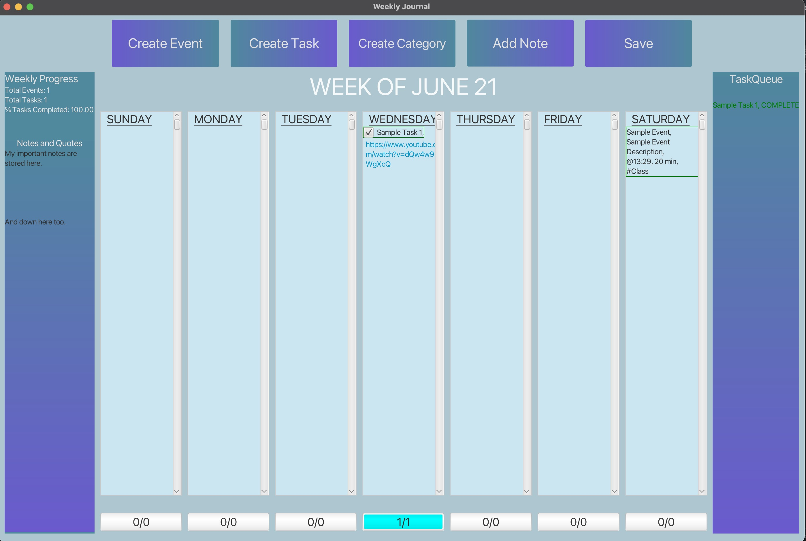

# Pitch: 
Our application is a great choice for keeping track of a week's appointments, both your tasks and events. Create
    a new file or open a previously created one from the open screen and decide to keep your previous max events or
    tasks or override then with a simple click a button. Keep your weekly journal secure with your own password. Create
    new categories from the week view, then automatically select it by typing it into the name of a new task or event
    starting with "#". Our application supports using valid links in the description of your tasks and events, and they
    are clickable and accessible from the weekly view. Keep track of your tasks with the daily progress bars, week 
    overview and task/event counts across the week view. Update task completion simply by checking the box and clicking
    anywhere on the screen. Keep track of any important notes across sessions by adding notes and viewing them simply
    from the week view. Notes are saved with your tasks and events, so no need to worry about losing your important 
    information!

GUI Screenshot: 

# SOLID Examples: 

# Single Responsibility Principle:
First, to help aid in facilitating Single Responsibility, we divided our project into three parts according to MVC. In
our Model package, we broke down our journal into smaller pieces comprised of objects representing a single task,
single event, single day, and notes. Then we created larger objects to represent a whole week, then encapsulated 
everything into a PlannerJson to be read/written into a .bujo file. Within each of these classes, the field and methods 
are designed to handle behaviors specific to each "unit" object that they are representing in our journal. Next, 
in our Controller package, we have multiple controllers that perform different jobs. For instance, one controls the 
opening of a .bujo file. Another controls the enter-password screen. Another controls the beginning splash screen. 
And finally, the last operates on the main week itself. As described, each of these controllers have a single 
responsibility in controlling different parts of the view. Finally, in the View, we broke it up similar
to the controllers. We have separate views for the open file, password, and the week as a whole. Each view is
responsible for separate scenes that will be displayed to the user.

# Open/Closed Principle:
In attempt to keep our design open to extension but closed for modification, we made use of interfaces and abstract
classes. In our View, we have a ViewScene interface that all of our View components implements. The contract that the
interface promises is that each of these classes have a load() method. This way, in the future, if someone wanted to
implement another view, they would be able to implement this class and extend the project that way, rather than
modifying one of our pre-existing classes to force another view. In our Controller, [[[[[[[......]]]]]]]

# Liskov's Substitution Principle:
We applied Liskov's substitution principle when designing our abstract classes. The main example would be our
AbstractPopup class, which was a way for us to abstract our CreateEventPopup and CreateTaskPopup as we found that their
implementations were very similar. They shared many common FXML objects, with some differences, and so we created an
abstract classes. We abide by the return types of each abstract method, and the implementations are so similar that
the superclass can be replaced with any of its subclasses, and our program will not break. 

# Interface Segregation Principle:
One interface we implemented was ViewScene, which has the .load() method. Every single class that implements this
has a supported implementation, thus not violating Interface Segregation (as in, each of these classes are not
forced to implement methods promised in the interface's contract).

# Dependency Inversion Principle:
In our controller module we have the ControlScene interface which contains a simple run() method, but allows all of our 
Views with FXML loaders to take in any of the different controllers, which follows the Dependency Inversion principle,
such that the view classes depend on the abstraction of the ControlScene rather than the individual controller classes.
The views for the Password, Open File, and Splash Screen views all take in a controller object as a means to set the 
controller for the FXML loader and allow the set class to control the loaded FXML files. In our implementation, these 
views could take in any ControlScene implementations. 

How to extend program further (with features we did not decide to implement): 
